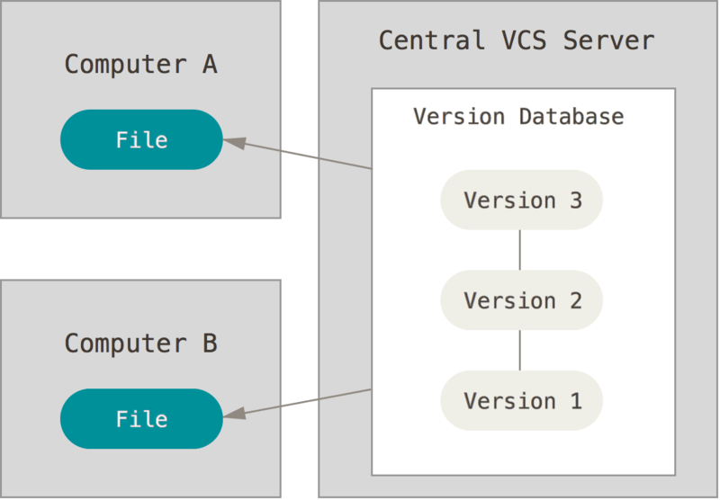

# Git 기초

[https://git-scm.com/book/en/v2](https://git-scm.com/book/en/v2)

# 버전 관리란?

VCS(version Control System)

: 파일 변화를 시간에 따라 기록했다가 나중에 특정 시점의 버전을 다시 꺼내올 수 있는 시스템

### 로컬 버전 관리

- 종류 : RCS
- Patch Set(파일에서 변경되는 부분)을 관리한다.
- Patch Set을 적용해서 모든 파일을 특정 시점으로 되돌릴 수 있다.

### 중앙집중식 버전 관리(CVCS)

파일을 관리하는 서버가 별도로 있고 클라이언트가 중앙 서버에서 파일을 받아서 사용(Checkout)한다.

- 종류 : CVS, Subversion, Perforce
- 장점 : VCS 에 비해 누가 무엇을 하는지 관리가 쉬움
- 단점 : 중앙 서버에 문제 발생시 복구 불가능

### 분산 버전 관리 시스템(DVCS)

클라이언트가 단순히 마지막 스냅샷을 checkout 하지 않고,

저장소를 히스토리와 더불어 전부 복제

- 종류 : git, Mecurial, Bazaar, Darcs
- 대부분의 DVCS 환경에서는 리모트 저장소가 존재 → 동시에 다양한 방법으로 협업 가능
- 장점 : 서버에 문제가 생기면 이 복제물로 다시 작업 가능

# Git 기초

keyword : `snapshot`, `checksum`

### Snapshots, Not Differences

- 기존 VCS
    - 관리하는 정보가 파일들의 목록
    - 각 파일의 변화를 시간순으로 관리하면서 파일들의 집합을 관리
- Git
    - 데이터를 저장하지도 취급하지도 않는다.
    - 데이터를 미니어처 파일 시스템의 일련의 스냅샷처럼 생각
    - 프로젝트를 저장하거나 커밋할 때마다 그 순간에 모든 파일이 어떻게 보이는지 사진을 찍고 해당 스냅샷에 대한 참조를 저장
    - 파일이 저장되지 않은 경우 파일을 다시 저장하지 않고, 이전의 파일 링크만 저장
    - Git은 데이터를 스냅샷 스트림과 유사하게 생각
- 

### 거의 모든 명령을 로컬에서 실행

- 프로젝트의 모든 히스토리가 로컬 디스크에 있기 때문에 모든 명령이 순식간에 실행된다
- 네트워크에 연결할 필요가 없다.
- ex) 히스토리를 조회할 때 서버 없이 로컬에서 조회
- 즉, 오프라인 상태이거나 VPN에 연결하지 못해도 막힘 없이 일 할 수 있다.

### 무결성

- Git은 데이터를 저장하기 전에 항상 체크섬을 구해서 데이터를 관리
    - **체크섬**은 ****Git에서 사용하는 가장 기본적인(Atomic) 데이터 단위이자 Git의 기본 철학
- Git은 모든 것을 해시로 식별

### Git은 데이터를 추가할 뿐

- git으로 무엇을 하든 git데이터베이스에 데이터가 추가된다.
- 되돌리거나 삭제할 방법이 없다.
- 일단 스냅샷을 커밋하고 나면 데이터를 잃어버리기 어렵다.

### Git workflow

Git 프로젝트의 세 가지 단계

1. 워킹 트리에서 파일을 수정한다.
2. Staging Area에 파일을 Stage 해서 커밋할 스냅샷을 만든다. 모든 파일을 추가할 수도 있고 선택하여 추가할 수도 있다.
3. Staging Area에 있는 파일들을 커밋해서 Git 디렉토리에 영구적인 스냅샷으로 저장한다.

- Git 디렉토리
    - Git이 프로젝트의 메타데이터와 객체 데이터베이스를 저장하는 곳
    - 다른 컴퓨터에 있는 저장소를 ***Clone*** 할 때 Git 디렉토리가 만들어진다.
- 워킹 트리
    - 프로젝트의 특정 버전을 Checkout 한 것
    - Git 디렉토리는 지금 작업하는 디스크에 있고 그 디렉토리 안에 압축된 데이터베이스에서 파일을 가져와서 워킹 트리를 만든다.
- Staging Area
    - 단순한 파일이고 곧 커밋할 파일에 대한 정보를 저장
    - Git 디렉토리에 위치

### 세가지 상태 ***

- Committed
    - 데이터가 로컬 데이터베이스에 안전하게 저장됐다.
    - Git directory에 있다면 committed 상태
- Modified
    - 수정한 파일을 아직 로컬 데이터베이스에 커밋하지 않았다.
- Staged
    - 현재 수정한 파일을 곧 커밋할 것이라고 표시한 상태
    - 파일을 수정하고 Staging Area에 추가했다면 Staged