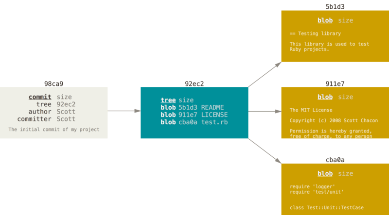
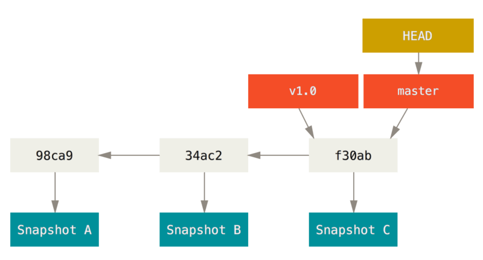
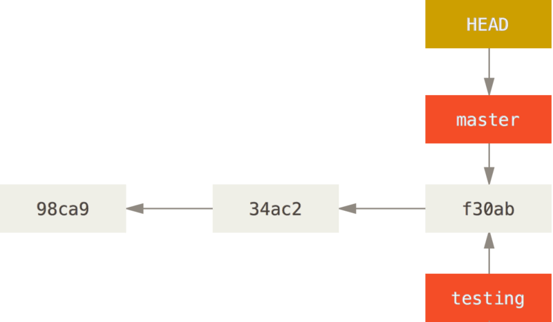
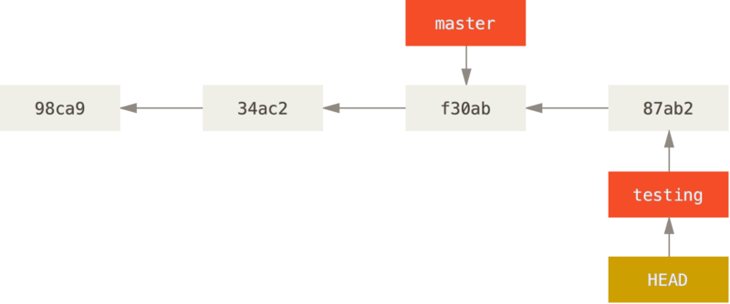
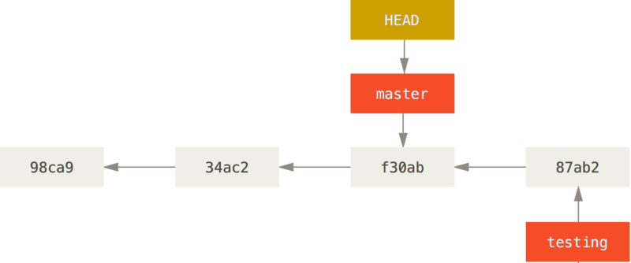
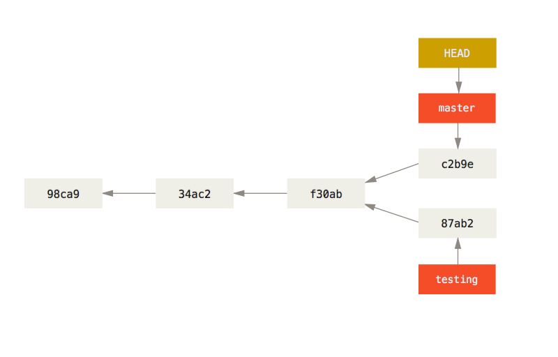

# 브랜치

Git의 최고의 장점
Git이 다른 버전 관리 도구와 구분되는 특징
매우 가볍다.

### Git이 데이터를 저장하는 방법

먼저 git이 데이터를 저장하는 방법을 알아보자.

- Git은 데이터를 Change Set이나 변경사항(Diff)으로 기록하지 않고 일련의 **스냅샷**으로 기록한다.
- 이전 커밋 포인터가 있어서 현재 커밋이 무엇을 기준으로 바뀌었는지를 알 수 있다.

`git commit` 으로 커밋하면 

1. 루트 디렉토리와 각 하위 디렉토리의 트리 개체를 체크섬과 함께 저장소에 저장
2. 커밋 개체를 만들고 메타데이터와 루트 디렉토리 트리 개체를 가리키는 포인터 정보를 저장

⇒ 각 파일의 **Blob**, **트리 개체**(파일과 디렉토리 구조가 들어있는 개체), **커밋 개체**(메타데이터와 루트 트리를 가리키는 개체)가 생긴다.



왼쪽부터 순서대로 커밋 개체, 트리개체, Blob


이전 커밋이 무엇인지도 저장한다.(parent)

### 브랜치란?

Git의 브랜치는 커밋 사이를 가볍게 이동할 수 있는 어떤 포인터 같은 것이다.

기본적으로 Git은 `master` 브랜치를 만든다. 

커밋을 만들면 `master` 브랜치는 자동으로 가장 마지막 커밋을 가리킨다.(처음 커밋하면 이 `master` 브랜치가 생성된 커밋을 가리킨다.)



### **새 브랜치 생성하기**

> `$ git branch <testing>`
> 

새로 만든 브랜치도 지금 작업하고 있던 마지막 커밋을 가리킨다.

브랜치를 만들기만 하고 브랜치를 옮기지 않는다.



**※ HEAD 포인터**

다른 버전 관리 시스템과는 달리 Git은 'HEAD’라는 특수한 포인터가 있다.

이 포인터는 지금 작업하는 로컬 브랜치를 가리킨다.

### **브랜치 이동하기**

> `$ git checkout <testing>`
다른 브랜치로 이동
> 
- HEAD는 testing 브랜치를 가리킨다.
- 브랜치를 이동하면 워킹 디렉토리의 파일이 변경된다
    - Git은 자동으로 워킹 디렉토리에 파일들을 추가하고, 지우고, 수정해서 Checkout 한 브랜치의 마지막 스냅샷으로 되돌려 놓는다.

브랜치 이동 후 새로 커밋을 하면 HEAD가 가리키는 testing 브랜치가 새 커밋을 가리킨다.



앞으로 커밋을 하면 다른 브랜치의 작업들과 별개로 진행되기 때문에 `testing` 브랜치에서 임시로 작업하고 원래 `master` 브랜치로 돌아와서 하던 일을 계속할 수 있다.



master 브랜치로 돌아와 파일을 수정하고 다시 커밋을 해보자.

- 프로젝트 히스토리는 분리돼 진행한다.
- 두 작업 내용은 서로 독립적으로 각 브랜치에 존재한다.
- 커밋 사이를 자유롭게 이동하다가 때가 되면 두 브랜치를 Merge 한다.



### Git 로그 확인하기

`$ git log --oneline --decorate --graph --all`

현재 브랜치가 가리키고 있는 히스토리가 무엇이고 어떻게 갈라져 나왔는지 보여준다.

```
$ git log --oneline --decorate --graph --all
* c2b9e (HEAD, master) made other changes
| * 87ab2 (testing) made a change
|/
* f30ab add feature #32 - ability to add new formats to the
* 34ac2 fixed bug #1328 - stack overflow under certain conditions
* 98ca9 initial commit of my project
```

Git의 브랜치는 어떤 한 커밋을 가리키는 40글자의 SHA-1 체크섬 파일에 불과하기 때문에 만들기도 쉽고 지우기도 쉽다.
새로 브랜치를 하나 만드는 것은 41바이트 크기의 파일을(40자와 줄 바꿈 문자) 하나 만드는 것에 불과하다.

브랜치가 필요할 때 프로젝트를 통째로 복사해야 하는 다른 버전 관리 도구와 차이가 극명하다.

게다가 커밋을 할 때마다 이전 커밋의 정보를 저장하기 때문에 Merge 할 때 어디서부터(Merge Base) 합쳐야 하는지 안다.