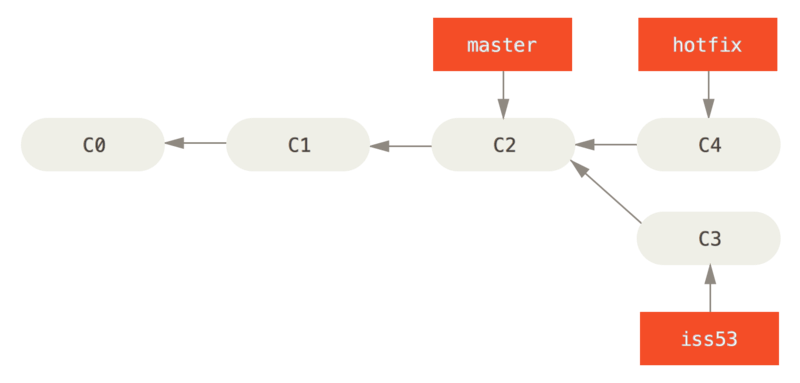
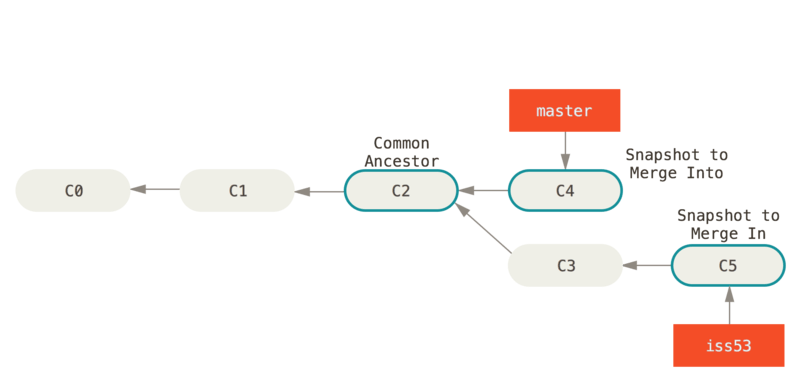
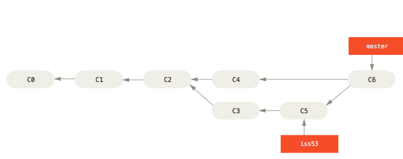

# **브랜치와 Merge 의 기초**

브랜치와 Merge는 보통 이런 식으로 진행한다.

1. 웹사이트가 있고 뭔가 작업을 진행하고 있다.
2. 새로운 이슈를 처리할 새 Branch를 하나 생성한다.
3. 새로 만든 Branch에서 작업을 진행한다.

이때 중요한 문제가 생겨서 그것을 해결하는 Hotfix를 먼저 만들어야 한다. 그러면 아래와 같이 할 수 있다.

1. 새로운 이슈를 처리하기 이전의 운영(Production) 브랜치로 이동한다.
2. Hotfix 브랜치를 새로 하나 생성한다.
3. 수정한 Hotfix 테스트를 마치고 운영 브랜치로 Merge 한다.
4. 다시 작업하던 브랜치로 옮겨가서 하던 일 진행한다.

브랜치를 만들면서 Checkout까지 한 번에 하려면`-b` 라는 옵션을 추가

`$ git checkout -b iss53`

그렇지만, 브랜치를 이동하려면 해야 할 일이 있다. 아직 커밋하지 않은 파일이 Checkout 할 브랜치와 충돌 나면 브랜치를 변경할 수 없다.

브랜치를 변경할 때는 워킹 디렉토리를 정리하는 것이 좋다.



```
$ git checkout master
$ git merge hotfix
Updating f42c576..3a0874c
Fast-forward
 index.html | 2 ++
 1 file changed, 2 insertions(+)
```

**※ Fast forward**

`hotfix` 브랜치가 가리키는 `C4` 커밋이 `C2` 커밋에 기반한 브랜치이기 때문에 브랜치 포인터는 Merge 과정 없이 그저 최신 커밋으로 이동한다. 이런 Merge 방식을 “Fast forward”라고 한다.

hotfix 브랜치 삭제

`-d` 옵션 사용

> `$ git branch -d hotfix`
> 



### Merge의 기초

3번 이슈를 다 구현하고 master 브랜치에 Merge 하는 과정을 살펴보자

> `$ git checkout master`
`$ git merge iss53`
> 

```
$ git checkout master
Switched to branch 'master'
$ git merge iss53
Merge made by the 'recursive' strategy.
index.html |    1 +
1 file changed, 1 insertion(+)
```

현재 브랜치가 가리키는 커밋이 Merge 할 브랜치의 조상이 아니므로 Git은 'Fast-forward’로 Merge 하지 않는다. 이 경우에는 Git은 각 브랜치가 가리키는 커밋 두 개와 공통 조상 하나를 사용하여 3-way Merge를 한다.

3-way Merge 의 결과를 별도의 커밋으로 만들고 나서 해당 브랜치가 그 커밋을 가리키도록 이동시킨다. 그래서 이런 커밋은 부모가 여러 개고 Merge 커밋이라고 부른다.




iss53 브랜치를 master에 Merge 하고 나면 더는 iss53 브랜치가 필요 없다. 다음 명령으로 브랜치를 삭제하고 이슈의 상태를 처리 완료로 표시한다.

`$ git branch -d iss53`

### 충돌의 기초

가끔씩 3-way Merge가 실패할 때도 있다. 

Merge 하는 두 브랜치에서 같은 파일의 한 부분을 동시에 수정하면 Git은 해당 부분을 Merge 하지 못한다.

```
$ git merge iss53
Auto-merging index.html
CONFLICT (content): Merge conflict in index.html
Automatic merge failed; fix conflicts and then commit the result.
```

자동으로 Merge 하지 못하면 새 커밋이 생기지 않는다. 

변경사항의 충돌을 개발자가 해결하지 않는 한 Merge 과정을 진행할 수 없다. 

Merge 충돌이 일어났을 때 Git이 어떤 파일을 Merge 할 수 없었는지 살펴보려면 `git status` 명령을 이용한다.

Git은 충돌이 난 부분을 표준 형식에 따라 표시해준다. 그러면 개발자는 해당 부분을 수동으로 해결한다.

충돌이 일어난 파일은 unmerged 상태로 표시

```
<<<<<<< HEAD:index.html
<div id="footer">contact : email.support@github.com</div>
=======
<div id="footer">
 please contact us at support@github.com
</div>
>>>>>>> iss53:index.html
```

`=======` 위쪽의 내용은 `HEAD` 버전( `master` 브랜치)의 내용이고 아래쪽은 `iss53` 브랜치의 내용이다. 충돌을 해결하려면 위쪽이나 아래쪽 내용 중에서 고르거나 새로 작성하여 Merge 한다.

충돌한 부분을 해결하고 `git add` 명령으로 다시 Git에 저장한다.

아래는 아예 새로 작성하여 충돌을 해결하는 예제다.

다른 Merge 도구도 충돌을 해결할 수 있다. `git mergetool` 명령으로 실행한다.

```
$ git mergetool

This message is displayed because 'merge.tool' is not configured.
See 'git mergetool --tool-help' or 'git help config' for more details.
'git mergetool' will now attempt to use one of the following tools:
opendiff kdiff3 tkdiff xxdiff meld tortoisemerge gvimdiff diffuse diffmerge ecmerge p4merge araxis bc3 codecompare vimdiff emerge
Merging:
index.html

Normal merge conflict for 'index.html':
  {local}: modified file
  {remote}: modified file
Hit return to start merge resolution tool (opendiff):
```

Merge 도구를 종료하면 Git은 잘 Merge 했는지 물어본다. 잘 마쳤다고 입력하면 자동으로 `git add` 가 수행되고 해당 파일이 Staging Area에 저장된다.

Staging Area에 저장됐는지 확인했으면 `git commit` 명령으로 Merge 한 것을 커밋한다.