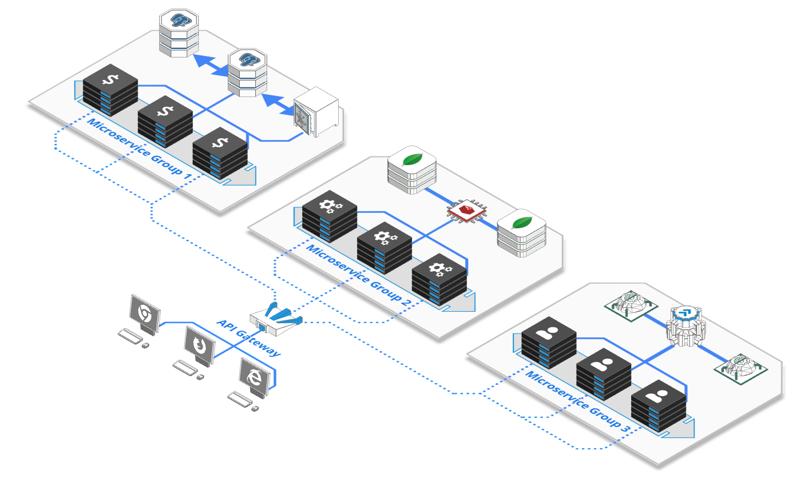
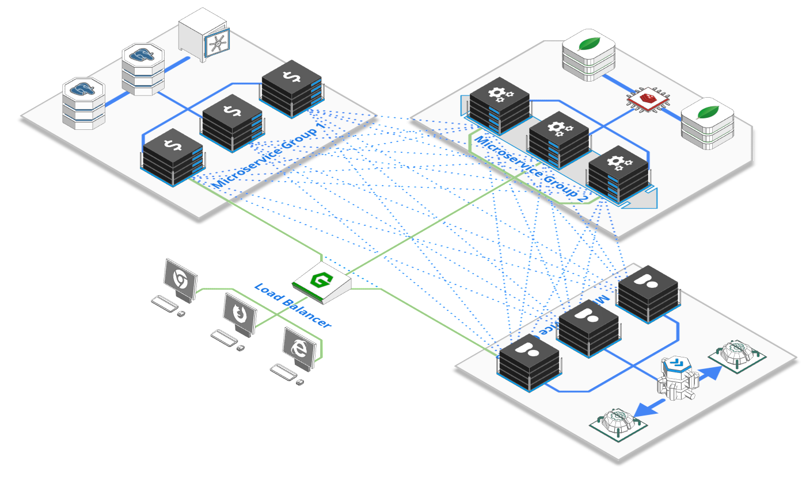
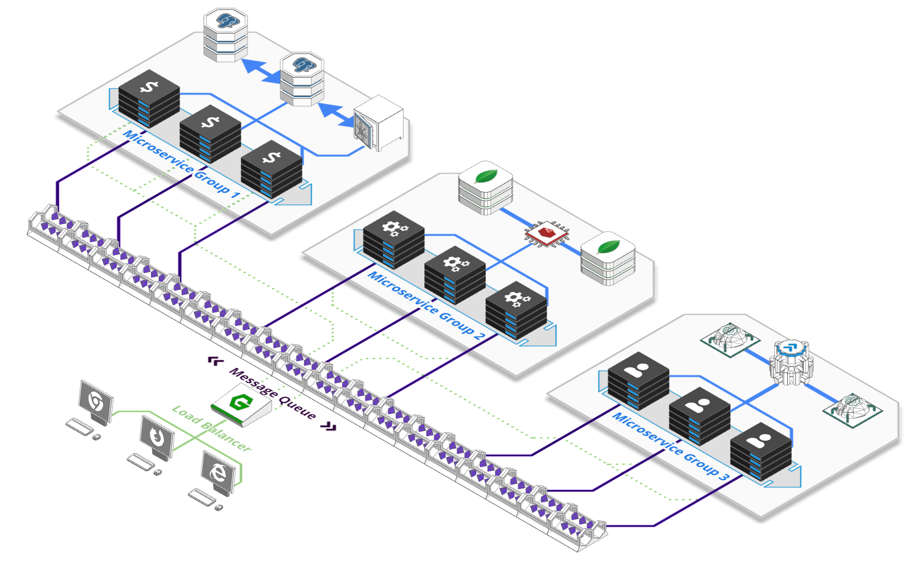

# Service Mesh vs API Gateway vs Message Queue

[Service Mesh VS API Gateway VS Message Queue - when to use what?](https://arcentry.com/blog/api-gateway-vs-service-mesh-vs-message-queue/)

# API Gateway

- load balancing and health checks, API versioning and routing, request authentication & authorization, data transformation, analytics, logging, SSL termination and more.
- 👍복잡성 낮음,
- 👎중앙집중식 새로운 API를 등록하거나 구성을 변경하려면 여전히 they still require a single point to register new APIs or change configuration.

# Service Mesh

- 서비스 메시는 로드 밸런싱, 엔드포인트 검색, 상태 점검, 모니터링 및 추적을 처리하는 마이크로서비스 인스턴스 간의 분산형 및 자체 구성 네트워크
- 트래픽을 매개하고 인스턴스 등록, 메트릭 수집 및 유지 보수를 처리하는 각 인스턴스에 "사이드카"라고 하는 작은 에이전트를 연결하여 작동
- 개념적으로 분산되어 있지만 대부분의 서비스 메쉬에는 데이터를 수집하거나 관리 인터페이스를 제공하기 위한 하나 이상의 중앙 요소가 포함
- Tool : Istio, Linkerd 또는 Hashicorp

- 👍 more dynamic and can easily shift shape and accommodate new functionalities and endpoints
- 👎 복잡함 can be quite complex and require a lot of moving parts.
- 👎 예를 들어 Istio를 완전히 활용하려면 각 노드에 별도의 트래픽 관리자, 원격 측정 수집기, 인증서 관리자 및 사이드카 프로세스가 필요합

# Message Queue

- 언뜻보면 서비스메시와 비슷하지만 매우 다른 방식
- 메시지 큐를 사용하면 송신자와 수신자를 분리하여 서비스 간 복잡한 통신 패턴을 설정할 수 있다
- 메시지 큐는 주제 기반 라우팅 또는 게시-구독 메시징과 같은 다양한 개념뿐만 아니라 여러 인스턴스가 시간이 지남에 따라 작업의 다양한 측면을 쉽게 처리할 수 있는 버퍼링된 작업 큐를 사용하여 이를 달성
- Open source : Apache Kafka, Rabbit과 같은 AMQP Broker
- 👍 단순히 송신자와 수신자를 분리하는 것은 상태 검사, 라우팅, 엔드포인트 발견 또는 로드 밸런싱과 같은 여러 다른 개념을 불필요하게 만드는 강력한 개념
- 👍 인스턴스는 버퍼링된 대기열에서 관련 작업을 선택할 수 있다.이는 자동 조정 및 스케일링 결정이 각 큐의 메시지 수를 기반으로 하여 리소스 효율성이 높은 시스템으로 이어질 때 특히 강력해진다.
- 👎메시지 대기열이 요청/응답 통신에 능숙하지 않습니다. 어떤 사람들은 이것이 기존 개념 위에 신발을 신도록 허용하지만, 실제로는 그것들이 만들어진 것이 아닙니다.
- 👎 버퍼의 특성 때문에 시스템에 상당한 대기 시간을 추가할 수도 있습니
- 👎 상당히 중앙 집중식(수평적으로 확장 가능함)이며, 대규모로 실행하는 데 상당한 비용이 소요될 수 있습니다.

# So…

실제로 API 게이트웨이를 사용하여 공개 API를 전면에 배치하고, 서비스 메시를 실행하여 서비스 간 통신을 처리하고, 비동기 작업 예약을 위한 메시지 대기열로 작업을 지원하는 것이 완벽하게 합리적일 수 있습니다.