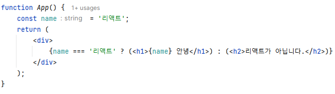

# 1. 리액트 이해

### render()

> 컴포넌트가 어떻게 생겼는지 정의
> 

초기렌더링, 조화 과정

## Virtual DOM

DOM 업데이트를 추상화함으로써 DOM 처리 횟수를 최소화하고 효율적으로 진행

- 실제 DOM에 접근하는 대신, 이를 추상화한 자바스크립트 객체를 구성하여 사

# 2. JSX

자바스크립트의 확장 문

## 문법

### 감싸인 요소

- 컴포넌트에 여러 요소가 있다면 반드시 부모 요소 하나로 감싼다.
- `<div>` 가 싫다면 `<Fregment>` 태그로 `<Fregment>`  = `<>`

### js 표현식은 `{ }` 로 감싸서

- 괄호 `( )` 는 한 줄 이상 넘어가면 필수

### if 문 대신 조건부 연산자

- 표현식 안에서 if문을 사용할 수 없다
- JSX 밖에서 if문을 사용하여 사전에 값을 설정하거나,
- `{ }` 안에서 조건부 연산자를 사용
    
    
    

### `&&` 연산자

- null check 할 때 자주 사용됨
- 아래 결과 윗줄과 동일


### undefined 를 렌더링 하지 않기

- 컴포넌트에서 undefined만 반환하여 렌더링하면 오류발생
- `||` (or 연산자 ) 사용해 null처리 해주기


### 인라인 스타일링

- DOM 요소에 스타일을 적용할 때는 문자열 형태가 아닌 객체 형태로


혹은 바로 지정하고 싶다면 `{ }` 한번 더 감싸 객체로 


### class 대신 className

### 태그는 꼭 닫아야한다

- html 에서 닫지 않아도 되는 `input` , `br` 태그도
- JSX 에서는 꼭 닫아줘야한다.
- `<input />`  self-closing 태그는 가능

### 주석

- `{/* ~~~ */}` 형태로 작성


# 3. 컴포넌트

## 클래스형 컴포넌트 vs 함수형 컴포넌트

### 함수형 컴포넌트


**장점**

- 선언하기 쉽다.
- 메모리 자원도 클래스형보다 덜 사용

단점

- state 와 라이프사이클 API 사용이 불가
(v16.8) 이후 Hooks 기능 도입 이후 해결

### 클래스형 컴포넌트


- state 기능 및 라이프사이클 기능을 사용할 수 있다.
- 임의 메서드를 정의할 수 있다.
- render 함수가 꼭 있어야한다.

> **ES6 의 클래스 문법**
> 
> 
> ```jsx
> class Dog {
> 	constructor(name){
> 		this.name = name;
> 	}
> 	say() {
> 		console.log(this.name + ' : 멍멍');
> 	}
> }
> 
> const dog = new Dog('흰둥이');
> dog.say(); //흰둥이: 멍멍
> ```
> 

## 컴포넌트 생성

`snippet` :  `rsc`


### 모듈 내보내기 불러오기

내보내기 

export default MyComponent 

불러오기 

import

## props

> properties 를 줄인 표현으로 
컴포넌트 속성을 설정할 때 사용하는 요소
> 
- props 는 부모 컴포넌트가 설정하는 값
- 컴포넌트 자신은 해당 props를 읽기 전용으로만 사용 가능


- MyComponent.js
    - JSX 내부에서 props 렌더링
- App.js
    - 컴포넌트 사용할 때 props 값 지정

### defaultProps

- props 기본값을 지정

```jsx
*MyComponent*.defaultProps = {  
	name: '기본 이름'
};
```


### props.children

컴포넌트 children값을 보여주는


### 비구조화 할당 destructing assignment

1. 


1. 


### proTypes

- 컴포넌트의 필수 props를 지정
- props의 타입 지정

## state

> 리액트에서 state 는 내부에서 바뀔 수 있는 값을 의미
> 

리액트에는 2가지 state가 있음

- 클래스 컴포넌트 형태가 지니는 state
- 함수형 컴포넌트에서 useState 함수를 통해 사용하는 state

### 클래스형 컴포넌트의 state


- this.setState 를 사용하여 state 값을 업데이트할 때는 상태가 비동기적으로 업데이트
- 

### 함수형 컴포넌트의 state


### state 사용 시 주의점

- setState 혹은 useState 를 통해 전달받은 세터 함수를 사용해야 한다.

# 4. 이벤트 핸들링

## 이벤트 사용 시 주의점

- 이벤트 이름은 카멜 표기법으로 작성
- 이벤트에 코드를 전달하는 것이 아니라 **함수 형태**의 값을 전달
- DOM 요소에만 이벤트 설정 가능
    - custom  컴포넌트에는 지정 불가

### 종류

- Clipboard
- Composition
- Keyboard
- Focus
- Form
- Mouse
- Selection

- Touch
- UI
- Wheel
- Media
- Image
- Animation
- Treansition

```jsx
import React, { useState } from "react";

const EventPractice = () => {
  const [form, setForm] = useState({
    username: "",
    message: "",
  });
  const { username, message } = form;
  const onChange = (e) => {
    const nextForm = {
      ...form, // 기존의 form 내용을 이 자리에 복사한 뒤
      [e.target.name]: e.target.value, //원하는 값을 덮어 씌우기
    };
    setForm(nextForm);
  };

  const onClick = () => {
    alert(username + ": " + message);
    setForm({
      username: "",
      message: "",
    });
  };
  const onKeyPress = (e) => {
    if (e.key === "Enter") {
      onClick();
    }
  };
  return (
    <div>
      <h1>이벤트 연습</h1>
      <input
        type="text"
        name="username"
        placeholder="사용자명"
        value={username}
        onChange={onChange}
      />
      <input
        type="text"
        name="message"
        placeholder="아무거나 입력해보세요"
        value={message}
        onChange={onChange}
      />
      <button onClick={onClick}>확인</button>
    </div>
  );
};

export default EventPractice;

```


# 5. `ref` : DOM에 이름 달기

> DOM 에  id 를 사용하면 컴포넌트를 여러번 사용할 경우 id 가 중복된다.
ref 는 컴포넌트 내부에서만 작동
> 

## ref 의 사용 이유

- DOM 을 직접적으로 건드려야할 때 사용한다.

### 꼭 사용해야하는 상황

- 특정 input에 포커스 주기
- 스크롤 박스 조작하기
- Canvas 요소에 그림 그리기 등

## ref 사용하기

### 1. 콜백 함수를 통한 ref 설정

### 2. createRef를 통한 ref 설정

## 컴포넌트에 ref 달기

# 6. 컴포넌트 반복

## 자바스크립트 배열의 map() 함수

### 문법

> arr.map(callback, [thisArg])
> 

## 배열을 컴포넌트 배열로 변환


이해 안됨,,,

## key

- 리액트에서 key는 컴포넌트 배열을 렌더링했을 때 
어떤 원소에 변동이 있었는지 알아내려고 사용

### key 설정


하지만 index 값을 고유값으로 사용하면 배열이 변동될 때 효율적으로 리렌더링 하지 못한다.

# 7. 컴포넌트의 라이프사이클 메서드

## 라이프사이클

### 마운트

> DOM이 생성되고 웹 브라우저상에 나타나는 것
> 

이때 호출되는 메서드

- **constructor**
    - 컴포넌트를 새로 만들 떄마다 호출되는 클래스 생성자 메서드
- **getDerivedStateFromProps**
    - props 에 있는 값을 state 에 넣을 때 사용하는 메서드
- **render**
    - UI를 렌더링하는 메서드
- **componentDidMount**
    - 컴포넌트가 웹 브라우저상에 나타난 후 호출하는 메서드

### 업데이트

- props가 바뀔 때
- state가 바뀔 때
- 부모 컴포넌트가 리렌더링될 때
- this.forceUpdate로 강제 렌더링을 트리거할 때

호출되는 메서드

- **getDerivedStateFromProps**
    - 업데이트가 시작되기 전에 호출
    - props의 변화에 따라 state 값에도 변화를 주고 싶을 때 사용
- **shouldComponentUpdate**
    - 컴포넌트가 리렌더링을 해야 할지 말아야 할지를 결정하는 메서드
    - true 혹은 false 반환
- **render**
    - 컴포넌트를 리렌더링
- **getSnapshotBeforeUpdate**
    - 컴포넌트 변화를 DOM에 반영하기 바로 직전에 호출하는 메서드
- **componentDidUpdate**
    - 컴포넌트의 작업이 끝난 후 호출하는 메서드
    - 

### 언마운트

> 마운트의 반대, 즉 컴포넌트를 DOM에서 제거하는 것
> 

메서드

- **componentWillUnmount**
    - 컴포넌트가 웹 브라우저상에서 사라지기 전에 호출하는 메서드

## 라이프사이클 메서드 살펴보기

### render()

- 컴포넌트의 모양새 정의
- 유일한 필수 메서드
- 주의
    - 이 메서드 안에서는 이벤트 설정이 아닌 곳에서 setState를 사용하면 안됨
    - 브라우저의 DOM에 접근하면 안됨
    - ⇒ DOM정보나 state정보 변경은 componentDidMount 에서 처리

### constructor

- 컴포넌트를 만들 때 처음으로 실행
- 초기 state 설정 가능

### getDerivedStateFromProps

- props로 받아 온 값을 state에 동기화시키는 용도로 사용

### componentDidMount

- 컴포넌트를 만들고, 첫 렌더링을 다 마친 후 실행
- 다른 자바스크립트 라이브러리 또는 프레임워크의 함수를 호출하거나
- 이벤트 등록, setTimeout, setInterval, 네트워크 요청 같은 비동기 작업을 처리하면 된다.

### shouldComponentUpdate

- props 또는 state를 변경했을 때, 리렌더링을 시작할지 여부를 지정하는 메서드
- return : true(default) / false
- false : 업데이트 과정 중단
- 프로젝트 성능 최적화 시에, 상황에 맞는 알고리즘을 작성하여 리렌더링을 방지할 때는 false로 반환

### getSnapshotBeforeUpdate

```jsx
getSnapshotBeforeUpdate(prevProps, prevState) {
    if (prevProps.list.length < this.props.list.length) {
      const list = this.listRef.current;
      return list.scrollHeight - list.scrollTop;
    }
    return null;
  }
```

- render 에서 만들어진 결과물이 브라우저에 실제로 반영되기 직전에 호출
- 반환값은 snapshot 으로 전달 받을 수 있음
- 주로 업데이트하기 직전의 값을 참고할 일이 있을 때 활용(예: 스크롤바 위치 유지)

### componentDidUpdate

- 리렌더링을 완료한 후 실행
- 업데이트가 끝난 직후이므로 DOM 처리를 해도 무방
- prevProps, prevState를 사용하여 컴포넌트가 이전에 가졌던 데이터에 접근할 수 있다.
- getSnapshotBeforeUpdate 에서 반환값이 있다면 여기서 snapshot 값을 전달받을 수 있다.

### componentWillUnmount

- 컴포넌트를 DOM에서 제거할 때 실행
- componentDidMount 에서 등록한 이벤트, 타이머, 직접 생성한 DOM이 있다면 여기서 제거해야한다.

### componentDidCatch

- 컴포넌트 렌더링 도중에 에러가 발생했을 때 애플리케이션이 먹통이 되지 않고
오류를 보여 줄 수 있게 해준다.

# 8. Hooks

> react v16.8 이후에 도입된 기능으로 
함수형 컴포넌트에서도 상태 관리를 할 수 있는 기능 제공
> 

> 리액트에서는 새로 작성하는 컴포넌트의 경우 클래스형 대신 
함수형 컴포넌트와 Hooks를 사용할 것을 권장하고 있다.
> 

## useState

## useEffect

컴포넌트가 렌더링될 때마다 특정 작업을 수행하도록 설정할 수 있는 Hook

## useReducer


> useState보다 더 다양한 컴포넌트 상황에 따라 다양한 상태를 다른 값으로 업데이트 해주고 싶을 때 사용하는 Hook
> 
- 리듀서는 현재 상태, 그리고 업데이트를 위해 필요한 정보를 담은 액션값을 전달받아 새로운 상태를 반환하는 함

- state :  현재 상태
- dispatch함수 : 액션을 발생시키는 함수

장점

- 컴포넌트 업데이트 로직을 컴포넌트 바깥으로 빼낼 수 있다.
- 인풋 많아져도 깔끔하게 관리 가능

```jsx
import React, { useEffect, useReducer, useState } from "react";

function reducer(state, action) {
  return {
    ...state,
    [action.name]: action.value,
  };
}

const Info = () => {
  const [state, dispatch] = useReducer(reducer, {
    name: "",
    nickname: "",
  });
  const { name, nickname } = state;

  useEffect(() => {
    console.log("effect");
    console.log(state.name);
    return () => {
      console.log("cleanup");
      console.log(state.name);
    };
  });

  const onChange = (e) => {
    dispatch(e.target);
  };

  return (
    <div>
      <div>
        <input name="name" value={name} onChange={onChange} />
        <input name="nickname" value={nickname} onChange={onChange} />
      </div>
      <div>
        <div>
          <b>이름 : </b> {name}
        </div>
        <div>
          <b>닉네임 : </b> {nickname}
        </div>
      </div>
    </div>
  );
};

export default Info;

```

## useMemo

- 함수형 컴포넌트 내부에서 발생하는 연산을 최적화할 수 있다.
- 렌더링하는 과정에서 특정 값이 바뀌었을 때만 연산 실행하고,
- 원하는 값이 바뀌지 않았다면 이전에 연산했던 결과를 재사용하는 방식

const cachedValue = useMemo(calculateValue, dependencies)

## useCallback

> 이벤트 핸들러 함수를 필요할 때만 생성할 수 있다.
> 

useMEmo로 함수를 반환하는 상황에서 더 편하게 사용할 수 있는 함수

### useMemo vs useCallback

- 숫자, 문자열, 객체처럼 일반 값을 재사용하려면 useMemo
- 함수를 재사용하려면 useCallback 사용

## useRef

> 함수형 컴포넌트에서 ref를 쉽게 사용할 수 있도록 해준다.
> 

```jsx

  const inputEl = useRef(null);

  const onInsert = useCallback(
    (e) => {
      const nextList = list.concat(parseInt(number));
      setList(nextList);
      setNumber("");
      inputEl.current.focus();
    },
    [number, list],
  ); // number 혹은 list가 바뀌었을 때만 함수 생성

<input value={number} onChange={onChange} ref={inputEl} />
```

## Custom Hooks 만들기

**useInput.js**

```jsx
import React, { useReducer } from "react";

function reducer(state, action) {
  return {
    ...state,
    [action.name]: action.value,
  };
}

/**
 * input 입력 관리
 * @param initialForm
 * @returns {[*,onChange]}
 */
export default function useInputs(initialForm) {
  const [state, dispatch] = useReducer(reducer, initialForm);
  const onChange = (e) => {
    dispatch(e.target);
  };
  return [state, onChange];
}

```

사


### Hooks 참조

[Collection of React Hooks](https://nikgraf.github.io/react-hooks/)

[https://github.com/rehooks/awesome-react-hooks](https://github.com/rehooks/awesome-react-hooks)

# 9. 컴포넌트 스타일링

# 10. 일정 관리 웹 어플리케이션 만들기

# 11. 컴포넌트 성능 최적화

## 느려지는 원인 분석

컴포넌트는 다음과 같은 상황에서 리렌더링 한다.

- 자신이 전달받은 props가 변경될때
- 자신의 state가 바뀔 때
- 부모 컴포넌트가 리렌더링 될 때
- forceUpdate 함수가 실행될 때

## React.memo를 사용하여 컴포넌트 성능 최적화

- 컴포넌트의 props가 바뀌지 않았다면, 리렌더링하지 않도록 설정하여 성능 최적화

> export할 때 React.memo( )로 감싸주면 된다.
> 


- TodoListItem은 todo, onRemove, onToggle 이 바뀌지 않으면 렌더링 하지 않는다.

## 함수가 계속만들어지는 것을 방지

### useState의 함수형 업데이트

`함수형 업데이트` : 상태 업데이트를 어떻게 할지 정의해 주는 업데이트 함수 

```jsx
setTodos(todos.concat(todo));
```

↓↓↓↓

```jsx
setTodos(todo => todos.concat(todo);
```

### useReducer 사용하기


- 상태를 업데이트하는 로직을 바깥에 둘 수 있다는 장점이 있다.
- 코드를 많이 고쳐야 한다.

## 불변성의 중요성

> 컴포넌트에서 상태를 업데이트할 때 불변성을 지키는 것은 매우 중요
> 

## react-virtualized를 사용한 렌더링 최적화

ex) 스크롤되기 전에 보이지 않는 컴포넌트는 렌더링하지 않고 크기만 차지하게끔

# 15. Context API

> 프로젝트 내에서 전역적으로 사용할 데이터가 있을 때 유용
>